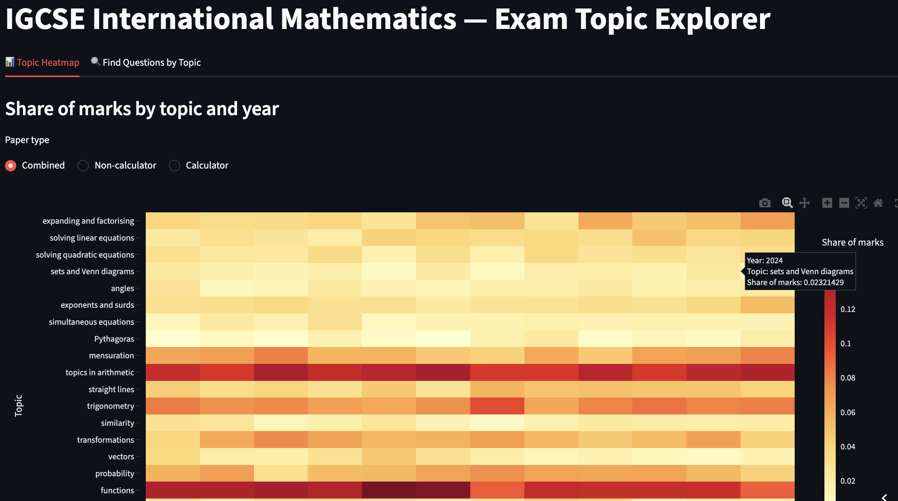

# Exam Topic Analysis

An AI-assisted prototype that quantifies topic distributions across past exam papers — built to answer the recurring student question: *"which topics come up most often?"*. A Streamlit dashboard is deployed [here](https://exam-topic-analysis-1.streamlit.app/).

## Motivation

Students preparing for exams often ask which topics are most likely to appear, but answering that well means manually reading through years of past papers and tagging every question by topic — tedious, slow, and error-prone. This project automates that process, turning a folder of past exam PDFs into a clear, visual breakdown of topic frequency and trends over time.

## What it does

- **Parses past exam papers (PDF)** — extracts individual questions and their associated marks.
- **Classifies each question** against a domain-defined topic list using an AI agent.
- **Validates results** against a manually labelled dataset to sanity-check classification quality.
- **Visualises trends** in an interactive dashboard, showing how topic emphasis has shifted across exam sittings.

## How it works

1. **PDF parsing** — Exam papers are ingested and broken down into individual questions, with marks allocation extracted alongside each one.
2. **Topic classification** — A [Google ADK](https://google.github.io/adk-docs/) agent reads each question and classifies it against a predefined list of domain topics.
3. **Validation** — Agent output is checked against a small (1%), manually labelled ground-truth set to estimate classification accuracy, achieving a Cohen's Kappa of **0.8277** (strong agreement).
4. **Visualisation** — A [Streamlit](https://streamlit.io/) dashboard presents topic distributions and trends, letting users explore how frequently each topic has appeared over time.

## Tech stack

- **Python**
- **Google ADK** — agent framework used for PDF parsing and question classification
- **Streamlit** — interactive dashboard for visualising results

## Status

This is an early-stage personal prototype, built independently to explore whether agentic AI tooling could meaningfully reduce the manual effort in exam topic analysis. Results are validated against manual labels but the pipeline is not yet production-hardened.

## Future work

- **Agentic refinement** — iterative self-correction in the classification agent to improve accuracy over time.
- **Automated evaluation** — replacing/supplementing manual validation with automated accuracy checks.
- **Testing** — unit and integration tests across the parsing and classification pipeline.
- **Monitoring** — tracking classification quality and pipeline health over time.

## Disclaimer

This is a personal project built for exploratory and educational purposes. Topic classifications are AI-generated and should be treated as indicative rather than authoritative.